
<h1 align="center">医院固定资产系统</h1>

## 简介
医院固定资产系统：用户角色包括管理员和科室，核心功能涵盖资产入库管理、出库管理、资产申请管理及申领管理，支持详细信息录入和资产状态跟踪，提升固定资产的管理效率。    --计算机毕业设计源码；毕设源码；java毕业设计源码

## 联系方式

<h3 align="center">获取完整代码与数据库文件 + 微信：deepguan QQ: 86050149 QQ群: 783742310</h3>

<h3 align="center">可帮忙远程部署 包运行成功！提供远程部署、修改代码、设计文档指导、代码讲解等服务！</h3>

## 功能介绍（完整见运行截图）
管理员： 登录和注册功能允许管理员进入系统并进行管理操作。首页提供导航栏指引，界面简洁明了，允许管理员访问个人中心、固定资产管理以及各项资产管理模块。资产管理涉及资产信息的录入、修改、删除，同时，提供图片上传、详细描述及入库出库管理。角色可在系统中进行资产审批，包括申购、申领管理，并进行相关操作记录的查看与修改。功能模块包括科室管理和管理员登录权限，确保系统的使用与操作的安全性和高效性。

科室用户： 科室用户拥有登录和注册功能，登录后可访问个人中心、资产入库、出库、申请、领用等管理模块，简便的导航栏协助高效完成各项资产管理任务。用户能在系统中录入和查看科室相关固定资产的信息，包括资产的编号、名称、类型、价格和数量，并能上传资产图片。科室用户可进行资产申购和申领申请，提交详细的申购原因和说明，并等待管理员审批。还可以通过搜索和查看资产清单，实现对科室资产的管理和查询，系统界面友好，便于灵活操作和高效管理。

## 运行截图

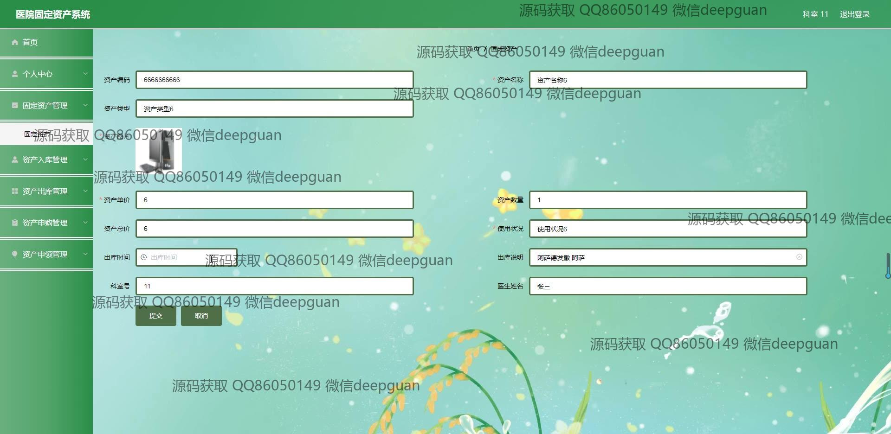
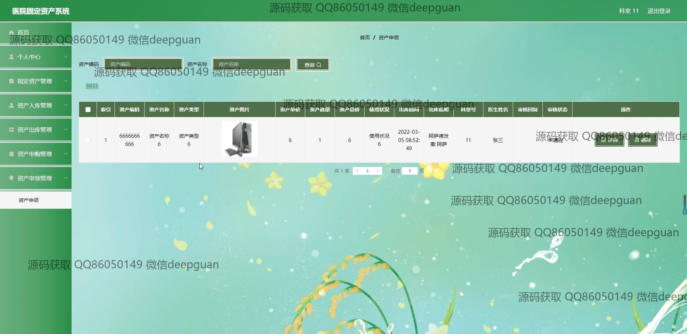
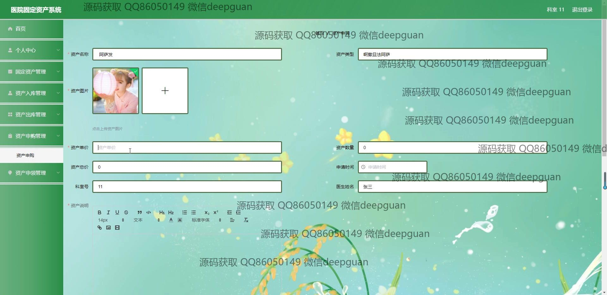
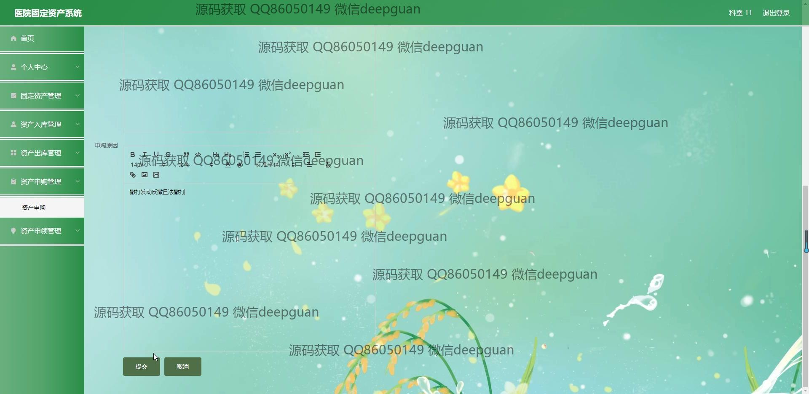

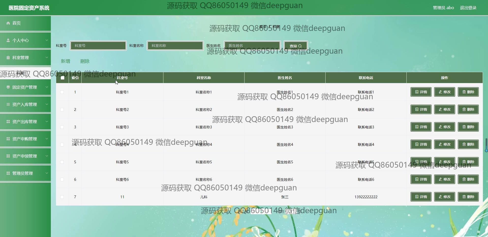
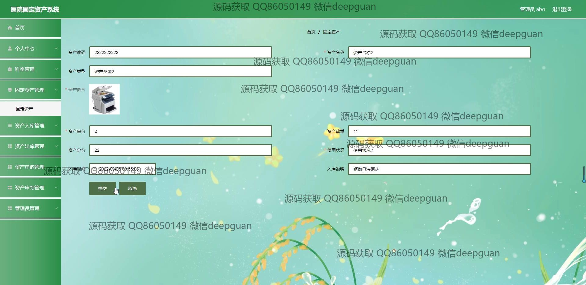
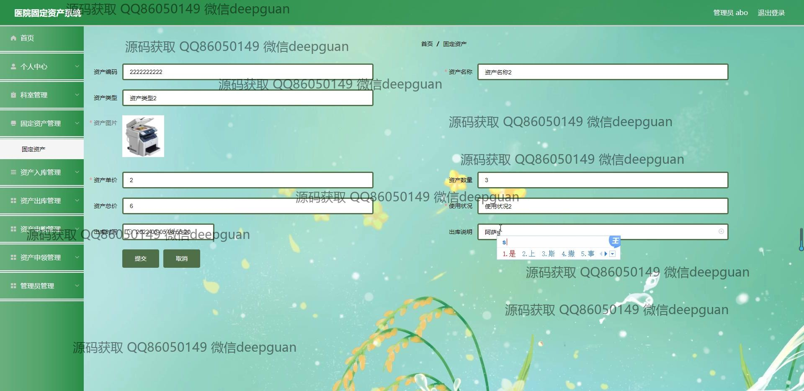
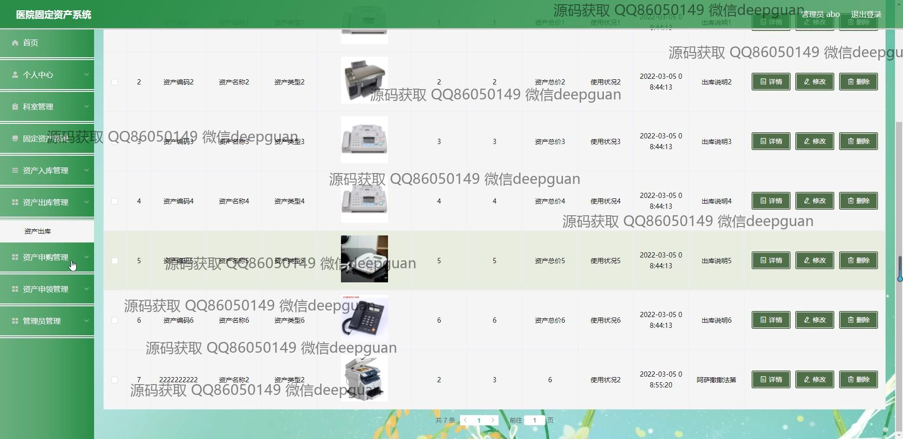
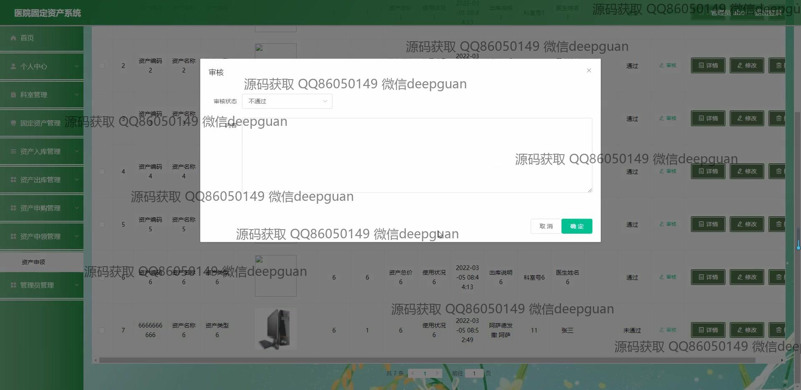
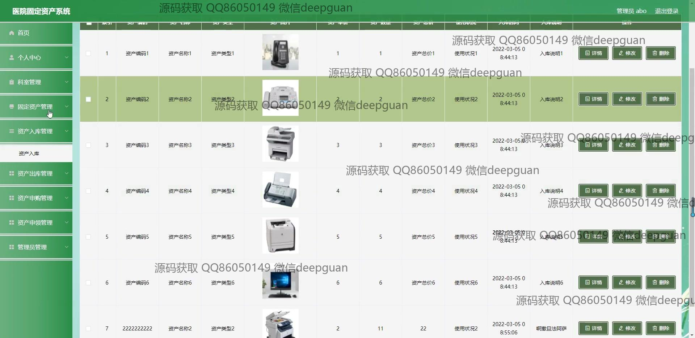
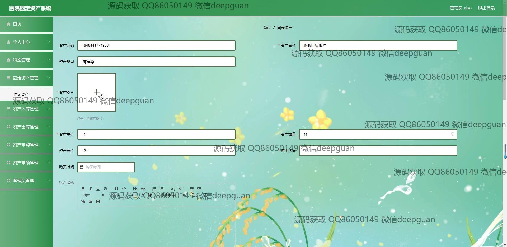

本代码来源于网络,仅供学习参考使用!

